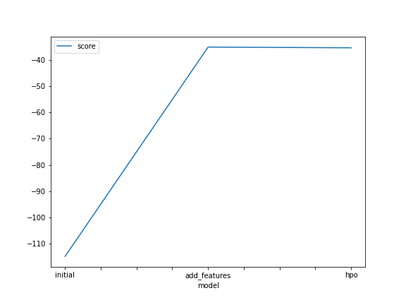
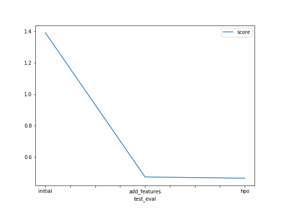

# Report: Predict Bike Sharing Demand with AutoGluon Solution
#### Daniel Oliveira de Brito

## Initial Training
### What did you realize when you tried to submit your predictions? What changes were needed to the output of the predictor to submit your results?
Some of the predicted values were negative. So, in order to submit my results, I had to replace the negative values with zero.

### What was the top ranked model that performed?
Initialy, my top ranked model was a `WeightedEnsemble_L3`.

## Exploratory data analysis and feature creation
### What did the exploratory analysis find and how did you add additional features?
In the EDA, I checked the distribution of the features. The `temp`, `atemp` and `humidity` have a distribution close to normal. On the other side, `windspeed` has positive skewness. The target value `count` also is asymmetrical, showing a positive skewness. Also, the EDA revealed the categorical variables `season` and `weather`.
The additional features added to the dataset were extracted from the `datetime` feature. The `month`, `day` (of the month) and `hour` were added to the training and testing data.

### How much better did your model preform after adding additional features and why do you think that is?
The model performed a lot better after adding additional features. The Root Mean Squared Logarithmic Error (RMSLE) was reduced from 1.39 to 0.47.

## Hyper parameter tuning
### How much better did your model preform after trying different hyper parameters?
The model performed a lot better after adding additional features. The Root Mean Squared Logarithmic Error (RMSLE) was reduced from 1.39 to 0.47. The features associated with date and time seem to be related to the number of bikes rented, which makes sense.

### If you were given more time with this dataset, where do you think you would spend more time?
I would spend more time in feature engineering, considering its improvement in the model performance.

### Create a table with the models you ran, the hyperparameters modified, and the kaggle score.
|model|time_limit|num_bag_folds|num_stack_levels|score|
|--|--|--|--|--|
|initial|600|10|3|1.39094|
|add_features|600|10|3|0.47173|
|hpo|900|5|4|0.46344|

### Create a line plot showing the top model score for the three (or more) training runs during the project.

### Create a line plot showing the top kaggle score for the three (or more) prediction submissions during the project.

## Summary
The best score on Kaggle was a Root Mean Squared Logarithmic Error (RMSLE) of  0.46344. The most remarkable improvement of the model performance is associated with the new features added. The hyperparameter tunning revealed a minor improvement in the model performance (RMSLE fell from 0.47173 to 0.464344). These results highlight the importance of the EDA and feature extraction on the Machine Learning pipeline. Also, it showed that Autogluon achieved a good performance when comparing the score with the other Kaggle competitors.